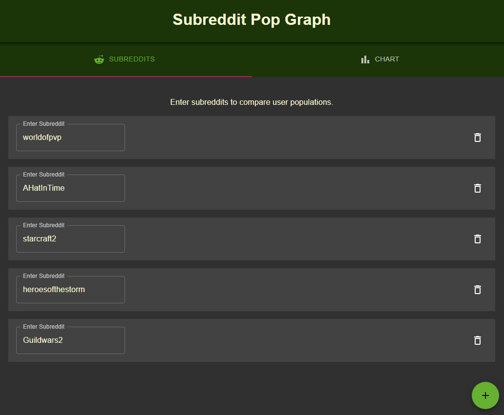
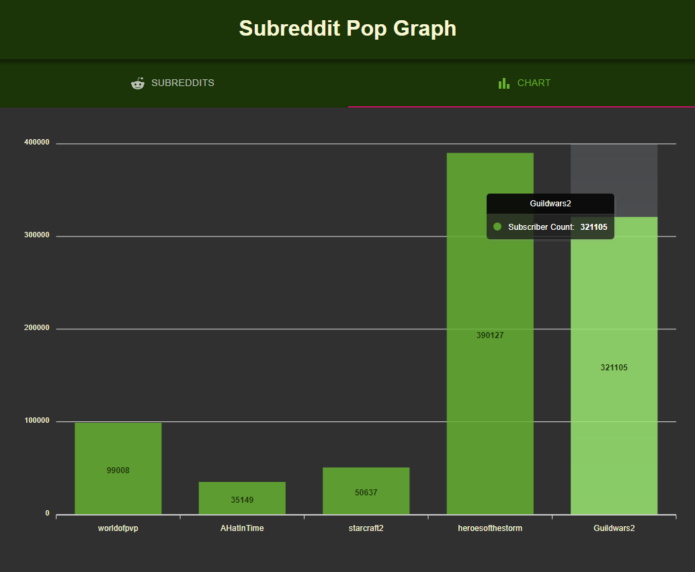

# Subreddit Pop Graph

Subreddit Pop Graph is a simple React application that utilizes the Reddit API to plot subscriber counts of entered subreddits against each other. Can be used to roughly gauge popularity of games or other topics of interest.

Live application can be accessed [here](https://caseydulong.github.io/subreddit-pop-graph/).

## Technologies Used

- JavaScript
- React
- CSS
- Reddit API

## Future Features

- Visual confirmation when API call is made successfully.
- Predictive subreddit autofill using Reddit API.
- Some raw data on subreddit entry form, such as subscriber counts.
- Ability to view a chart of other types of data, such as active user counts or population growth.

---

## Media

### Subreddit Entry Form

### Subreddit Subscriber Count Chart

---

## Installation

- Run `npm start` to start the React app.
- Run `npm run deploy` to deploy the current branch to the live site.
